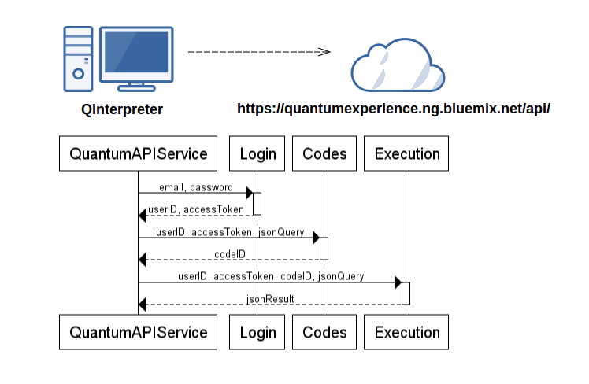
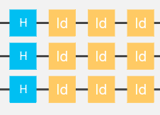

# QInterpreter

This Interpreter is based on [IBM Quantum Experience Processor](https://quantumexperience.ng.bluemix.net).

Given a *.q* file with instructions generates a *.json* file similar to the response generated by Quantum Experience API.

If the file have no errors, is sent to Quantum Experience API and dumps the response with the result of the simulation into another *.json* file.

## Online Interpreter

If you want to try the interpreter online please check [Quantum Online Interpreter](http://51.254.210.58:8181/OnlineQInterpreter/)

May have some bugs.

## Install dependencies

```bash
sudo apt-get install libcurl4-openssl-dev
sudo apt-get install flex
sudo apt-get install bison
```

## Build the project

Using the command-line, go to the project root folder and execute the next commands:

```bash
mkdir build
cd build
cmake ..
make
```

The binary *QInterpreter* is generated under the *build* folder. You have to supply a *.q* file as the first parameter.
For example, after a succesfull build, execute the next command:

```bash
./QInterpreter ../examples/BellStateZZMeasurement.q
```

## Example Bell State ZZ Measurement


### (Input) BellStateZZMeasurement.q

```c
// Bell State ZZ Measurement
h q[1];
cx q[1], q[2];
measure q[1,2];
```

### (Output) BellStateZZMeasurement.json

```javascript
{
    "jsonQasm": {
        "playground": [{
            "line": 0,
            "name": "q",
            "gates": []
        }, {
            "line": 1,
            "name": "q",
            "gates": [{
                "position": 0,
                "name": "h"
            }, {
                "position": 2,
                "name": "measure"
            }]
        }, {
            "line": 2,
            "name": "q",
            "gates": [{
                "position": 1,
                "name": "cx",
                "to": 1
            }, {
                "position": 2,
                "name": "measure"
            }]
        }, {
            "line": 3,
            "name": "q",
            "gates": []
        }, {
            "line": 4,
            "name": "q",
            "gates": []
        }],
        "numberColumns": 40,
        "numberLines": 5,
        "numberGates": 4,
        "hasMeasures": true,
        "topology": "250e969c6b9e68aa2a045ffbceb3ac33"
    }
}
```

### (Output) BellStateZZMeasurementResult.json

```
{
  "execution": {
    "result": {
      "date": "2016-05-03T07:57:38.376Z",
        "data": {
          "p": {
           "qubits": [1, 2],
           "labels": ["00", "01", "10", "11"],
           "values": [0.46578058604498057, 0.010055914979718002, 0.036575746838289756, 0.48758775213701194]
           ...
```

## Architecture




## Syntax

### Simple Instructions

```c
x q[n];
y q[n];
z q[n];
id q[n];
h q[n];
s q[n];
t q[n];
tdg q[n];
sdg q[n];
cx q[n], q[m];
measure q[n];
bloch q[n];
```

Such that m, n between 0-4.

### Complex instructions

* Multiple bit gate
```c
    x q [1,2,4];
``` 

* Repeat instructions
```c
    repeat 5 {
        x q [1];
        h q [2];
    }
```

* Comments
```c
    // This is a comment
```

* Example

    
```c
    h q [1,2,3]; // Place h gates in bit one, two and three
    repeat 3 { // Do three times the instruction below 
        id q [1,2,3]; // Place id gates in bit one, two and three
    }
```

## Errors Controlled

* Syntax errors
* Positions out of bounds (bits 0-4, positions 0-39)
* No measures
* Two kinds of measures
* Adding a gate in a line after a measure

In that cases, the ".json" file is not generated.
