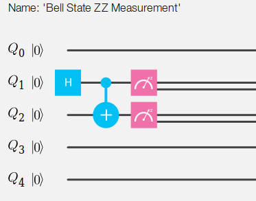

# QInterpreter

This Interpreter is based on [IBM Quantum Experience Processor](https://quantumexperience.ng.bluemix.net).

Given a ".q" file with instructions generates a ".json" file similar to the IBM API response.

## Start Up

Using the command-line, go to the project root folder and execute 

```shell
mkdir build
cd build
cmake ..
make
```

The binary *QInterpreter* is generated under de folder *build*. You have to supply a *.q* file as the first parameter.
For example, after a succesfull build, execute the next command

```shell
./QInterpreter ../examples/BellStateZZMeasurement.q
```

## Example Bell State ZZ Measurement



###BellStateZZMeasurement.q

```c
h q[1];
cx q[1], q[2];
measure q[1];
measure q[2];
```

###BellStateZZMeasurement.json

```javascript
{
    "jsonQasm": {
        "playground": [{
            "line": 0,
            "name": "q",
            "gates": []
        }, {
            "line": 1,
            "name": "q",
            "gates": [{
                "position": 0,
                "name": "h"
            }, {
                "position": 2,
                "name": "measure"
            }]
        }, {
            "line": 2,
            "name": "q",
            "gates": [{
                "position": 1,
                "name": "cx",
                "to": 1
            }, {
                "position": 2,
                "name": "measure"
            }]
        }, {
            "line": 3,
            "name": "q",
            "gates": []
        }, {
            "line": 4,
            "name": "q",
            "gates": []
        }],
        "numberColumns": 40,
        "numberLines": 5,
        "numberGates": 4,
        "hasMeasures": true
    }
}
```

## Architecture


## Syntax

```c
x q[n];
y q[n];
z q[n];
id q[n];
h q[n];
s q[n];
t q[n];
tdg q[n];
sdg q[n];
cx q[n], q[m];
measure q[n];
bloch q[n];
```

So that m, n between 0-4.

Comments with "//"

## Errors Controlled

* Syntax errors
* Positions out of bounds (bits 0-4, positions 0-39)
* No measures
* Two kinds of measures
* Adding a gate in a line after a measure

In that cases, the ".json" file is not generated.
